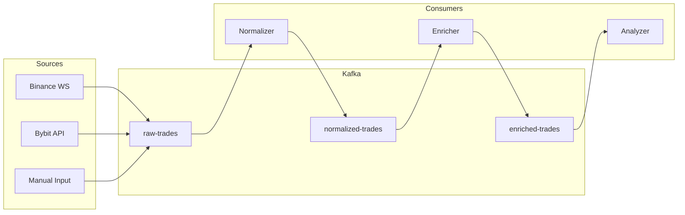

# 1. Kafka Pipeline - Data Ingestion & Streaming

## 📋 Mô Tả Nghiệp Vụ

### Vấn đề cần giải quyết
Trader cần một hệ thống có thể:
- **Thu thập dữ liệu từ nhiều nguồn**: API sàn giao dịch (Binance, Bybit), nhập tay, import file CSV
- **Xử lý real-time**: Mỗi giao dịch mới cần được phân tích ngay lập tức
- **Đảm bảo không mất dữ liệu**: Dù hệ thống có sự cố, dữ liệu giao dịch phải được bảo toàn
- **Khả năng mở rộng**: Theo dõi được nhiều mã (symbols) cùng lúc

### Luồng nghiệp vụ
```
┌─────────────────────────────────────────────────────────────────┐
│                      NGUỒN DỮ LIỆU                              │
├─────────────┬─────────────────┬─────────────────────────────────┤
│ Binance API │ Manual Entry    │ CSV Import                      │
│ Bybit API   │ (User nhập tay) │ (Lịch sử giao dịch)             │
└──────┬──────┴────────┬────────┴────────────────┬────────────────┘
       │               │                         │
       ▼               ▼                         ▼
┌─────────────────────────────────────────────────────────────────┐
│                    KAFKA TOPICS                                  │
├─────────────────────────────────────────────────────────────────┤
│ raw-trades → normalized-trades → enriched-trades → alerts       │
└─────────────────────────────────────────────────────────────────┘
```

### Yêu cầu nghiệp vụ cụ thể

| ID | Requirement | Mô tả |
|----|-------------|-------|
| KF-01 | Multi-symbol tracking | Theo dõi bất kỳ mã coin/stock nào user muốn |
| KF-02 | Real-time ingestion | Nhận trade mới trong < 1 giây |
| KF-03 | Data normalization | Chuẩn hóa format từ các sàn khác nhau |
| KF-04 | Fault tolerance | Không mất data khi service restart |
| KF-05 | Scalability | Xử lý được 1000+ trades/phút |

---

## 🔧 Xử Lý Kỹ Thuật

### Kiến trúc



### Tech Stack
- **Message Queue**: Apache Kafka 3.x (hoặc Redpanda cho lightweight)
- **Producer**: Python + `aiokafka` (async)
- **Consumer**: Python + `faust-streaming` (stream processing)
- **Serialization**: Avro/JSON Schema

### Kafka Topics Design

| Topic | Purpose | Retention |
|-------|---------|-----------|
| `raw-trades` | Giao dịch thô từ nguồn | 7 days |
| `normalized-trades` | Đã chuẩn hóa format | 30 days |
| `enriched-trades` | Đã gắn market context | 90 days |
| `behavioral-alerts` | Cảnh báo hành vi | 7 days |

### Data Schema (Avro)

```json
{
  "type": "record",
  "name": "Trade",
  "fields": [
    {"name": "trade_id", "type": "string"},
    {"name": "user_id", "type": "string"},
    {"name": "symbol", "type": "string"},
    {"name": "side", "type": {"type": "enum", "symbols": ["BUY", "SELL"]}},
    {"name": "entry_price", "type": "double"},
    {"name": "exit_price", "type": ["null", "double"]},
    {"name": "quantity", "type": "double"},
    {"name": "entry_time", "type": "long"},
    {"name": "exit_time", "type": ["null", "long"]},
    {"name": "pnl", "type": ["null", "double"]},
    {"name": "notes", "type": ["null", "string"]},
    {"name": "source", "type": "string"}
  ]
}
```

### Implementation Files

| File | Chức năng |
|------|-----------|
| `kafka/producer.py` | Publish trades vào raw-trades topic |
| `kafka/consumer.py` | Consumer groups cho processing |
| `kafka/normalizer.py` | Chuẩn hóa data từ các sàn |
| `kafka/schemas.py` | Avro schemas definition |

### API Endpoints liên quan

```python
POST /api/trades                 # Manual trade entry → Kafka
POST /api/trades/import          # CSV import → Kafka
WS   /ws/trades/{user_id}        # WebSocket feed từ Kafka
```

### Demo Mode (Hackathon)
Khi không có Kafka infrastructure:
```python
# Sử dụng asyncio.Queue thay thế
from asyncio import Queue
trade_queue = Queue()

# Interface giống Kafka producer
async def publish_trade(trade: Trade):
    await trade_queue.put(trade)
```
