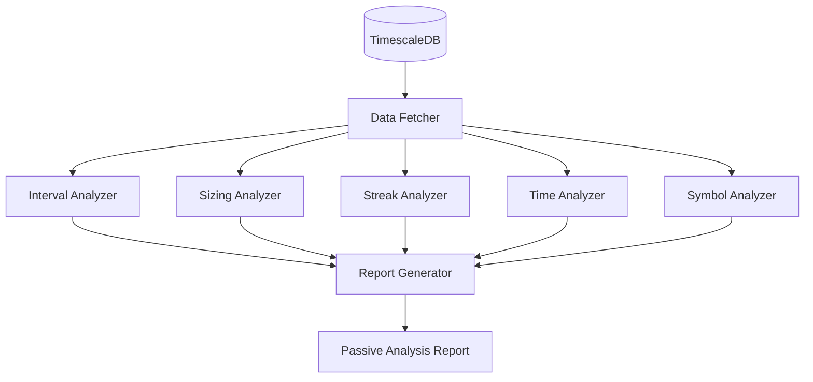

# 2. Passive Analyzer - Phân Tích Thụ Động

## 📋 Mô Tả Nghiệp Vụ

### Vấn đề cần giải quyết
Trader thường không nhận ra các **pattern xấu** trong hành vi giao dịch của mình vì:
- Không có thời gian review lại lịch sử
- Thiếu công cụ phân tích tự động
- Cảm xúc che mờ sự khách quan

**Passive Analyzer** sẽ tự động phân tích **lịch sử giao dịch** để tìm ra các lỗi hệ thống.

### Các chỉ số phân tích thụ động

| Chỉ số | Mô tả nghiệp vụ | Ý nghĩa |
|--------|-----------------|---------|
| **Trade Intervals** | Khoảng cách thời gian giữa các lệnh | Phát hiện nhồi lệnh sau khi thua |
| **Position Sizing** | So sánh khối lượng vào lệnh | Phát hiện tăng size sau loss (revenge) |
| **Win/Loss Streaks** | Chuỗi thắng/thua liên tiếp | Đo lường ảnh hưởng tâm lý |
| **Hold Duration** | Thời gian giữ lệnh | So sánh hold khi lời vs lỗ |
| **Time Patterns** | Hiệu suất theo giờ/ngày | Tìm "giờ vàng" giao dịch |
| **Symbol Performance** | P&L theo từng mã | Tìm mã trader có edge |

### Use Cases

```
┌─────────────────────────────────────────────────────────────────┐
│ USE CASE 1: Phát hiện Revenge Trading Pattern                  │
├─────────────────────────────────────────────────────────────────┤
│ Input:  Lịch sử 100 trades gần nhất                            │
│ Analyze: Tìm pattern "Loss → Quick entry → Bigger size"        │
│ Output: "Bạn có xu hướng tăng 40% position sau mỗi lần thua"   │
└─────────────────────────────────────────────────────────────────┘

┌─────────────────────────────────────────────────────────────────┐
│ USE CASE 2: Time-based Performance                              │
├─────────────────────────────────────────────────────────────────┤
│ Input:  Tất cả trades với timestamp                            │
│ Analyze: Win rate theo giờ trong ngày                          │
│ Output: "Win rate 8-10AM: 65%, 2-4PM: 35% → Tránh trade chiều" │
└─────────────────────────────────────────────────────────────────┘

┌─────────────────────────────────────────────────────────────────┐
│ USE CASE 3: Symbol Edge Detection                               │
├─────────────────────────────────────────────────────────────────┤
│ Input:  Trades grouped by symbol                               │
│ Analyze: Sharpe ratio, win rate per symbol                     │
│ Output: "BTC: Sharpe 1.2, ETH: Sharpe -0.3 → Focus on BTC"    │
└─────────────────────────────────────────────────────────────────┘
```

---

## 🔧 Xử Lý Kỹ Thuật

### Kiến trúc



### Algorithms

#### 1. Trade Interval Analysis
```python
def analyze_intervals(trades: List[Trade]) -> Dict:
    """
    Tính khoảng cách giữa các trades.
    Phát hiện "nhồi lệnh" khi interval < threshold sau loss.
    """
    intervals = []
    for i in range(1, len(trades)):
        interval = trades[i].entry_time - trades[i-1].exit_time
        prev_pnl = trades[i-1].pnl
        intervals.append({
            "interval_minutes": interval / 60,
            "after_loss": prev_pnl < 0,
            "after_win": prev_pnl > 0
        })
    
    # Phát hiện pattern
    avg_after_loss = mean([i["interval_minutes"] for i in intervals if i["after_loss"]])
    avg_after_win = mean([i["interval_minutes"] for i in intervals if i["after_win"]])
    
    return {
        "avg_interval_after_loss": avg_after_loss,
        "avg_interval_after_win": avg_after_win,
        "rushing_after_loss": avg_after_loss < avg_after_win * 0.5,
        "recommendation": "Chờ ít nhất 30 phút sau khi thua" if rushing else None
    }
```

#### 2. Position Sizing Pattern
```python
def analyze_sizing(trades: List[Trade]) -> Dict:
    """
    So sánh position size sau win vs sau loss.
    Phát hiện revenge trading (tăng size sau loss).
    """
    size_changes = []
    for i in range(1, len(trades)):
        size_ratio = trades[i].quantity / trades[i-1].quantity
        prev_pnl = trades[i-1].pnl
        size_changes.append({
            "size_ratio": size_ratio,
            "after_loss": prev_pnl < 0
        })
    
    avg_increase_after_loss = mean([
        s["size_ratio"] for s in size_changes 
        if s["after_loss"] and s["size_ratio"] > 1
    ])
    
    return {
        "avg_size_increase_after_loss": avg_increase_after_loss,
        "revenge_pattern_detected": avg_increase_after_loss > 1.3,  # >30% increase
        "severity": "HIGH" if avg_increase_after_loss > 1.5 else "MEDIUM"
    }
```

#### 3. Hold Duration Comparison
```python
def analyze_hold_duration(trades: List[Trade]) -> Dict:
    """
    So sánh thời gian giữ lệnh khi lời vs khi lỗ.
    Loss aversion = giữ lệnh lỗ lâu hơn lệnh lời.
    """
    winning_holds = [t.hold_duration for t in trades if t.pnl > 0]
    losing_holds = [t.hold_duration for t in trades if t.pnl < 0]
    
    avg_win_hold = mean(winning_holds)
    avg_loss_hold = mean(losing_holds)
    
    return {
        "avg_winning_hold_minutes": avg_win_hold,
        "avg_losing_hold_minutes": avg_loss_hold,
        "loss_aversion_ratio": avg_loss_hold / avg_win_hold,
        "loss_aversion_detected": avg_loss_hold > avg_win_hold * 2,
        "recommendation": "Cắt lỗ nhanh hơn, để lời chạy" if ratio > 2 else None
    }
```

### Output Schema

```python
@dataclass
class PassiveAnalysisReport:
    user_id: str
    period: str  # "last_30_days", "last_100_trades"
    
    # Metrics
    total_trades: int
    win_rate: float
    profit_factor: float
    sharpe_ratio: float
    max_drawdown: float
    
    # Behavioral Patterns
    interval_analysis: IntervalAnalysis
    sizing_analysis: SizingAnalysis
    hold_analysis: HoldAnalysis
    time_analysis: TimeAnalysis
    symbol_analysis: SymbolAnalysis
    
    # Recommendations
    recommendations: List[str]
    risk_score: float  # 0-100
```

### Implementation Files

| File | Chức năng |
|------|-----------|
| `analyzers/passive_analyzer.py` | Main passive analysis engine |
| `analyzers/interval_analyzer.py` | Trade interval patterns |
| `analyzers/sizing_analyzer.py` | Position sizing patterns |
| `analyzers/time_analyzer.py` | Time-based performance |
| `analyzers/report_generator.py` | Generate analysis reports |

### API Endpoints

```python
GET /api/analysis/passive                    # Full passive analysis
GET /api/analysis/passive/intervals          # Interval analysis only
GET /api/analysis/passive/sizing             # Sizing patterns only
GET /api/analysis/passive/time-patterns      # Time-based analysis
GET /api/analysis/passive/symbols            # Per-symbol breakdown
```
