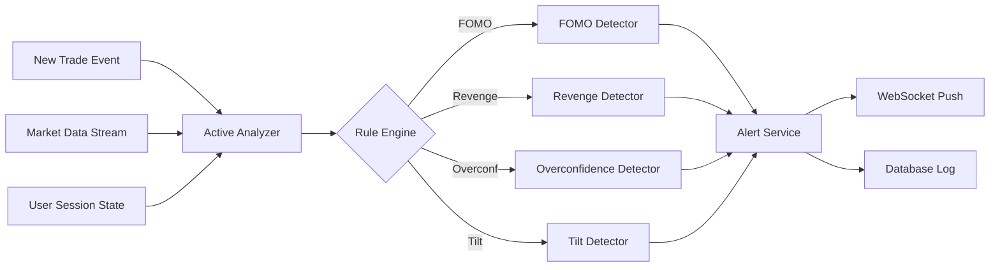

# 3. Active Analyzer - Phân Tích Chủ Động (Real-time)

## 📋 Mô Tả Nghiệp Vụ

### Vấn đề cần giải quyết
Trong khi **Passive Analyzer** phân tích lịch sử, **Active Analyzer** cần:
- **Phát hiện ngay lập tức** khi trader đang có hành vi rủi ro
- **Cảnh báo real-time** trước khi trader vào lệnh sai
- **Ngăn chặn thiệt hại** bằng alerts và recommendations

### Các hành vi rủi ro cần phát hiện REAL-TIME

| Hành vi | Dấu hiệu phát hiện | Độ nghiêm trọng |
|---------|-------------------|-----------------|
| **FOMO** | Entry after pump >5%, keywords khẩn cấp | 🔴 HIGH |
| **Revenge Trading** | Loss lớn + Entry nhanh + Size tăng | 🔴 HIGH |
| **Overconfidence** | Win streak 3+ + Size tăng đột ngột | 🟡 MEDIUM |
| **Overtrading** | >10 trades/day với win <40% | 🟡 MEDIUM |
| **Loss Aversion** | Holding loss >3x average | 🟠 HIGH |
| **Tilt Trading** | Drawdown >5% + Trade frequency tăng | 🔴 CRITICAL |

### Luồng nghiệp vụ Real-time

```
┌─────────────────────────────────────────────────────────────────┐
│ TRIGGER: User vào lệnh mới hoặc đang hold position              │
└─────────────────────────────────────┬───────────────────────────┘
                                      │
                                      ▼
┌─────────────────────────────────────────────────────────────────┐
│ CONTEXT GATHERING                                               │
├─────────────────────────────────────────────────────────────────┤
│ • Last 5 trades (P&L, timing, size)                            │
│ • Current market conditions (price change last 1h)             │
│ • User's note/mood (NLP analysis)                              │
│ • Current drawdown level                                        │
└─────────────────────────────────────┬───────────────────────────┘
                                      │
                                      ▼
┌─────────────────────────────────────────────────────────────────┐
│ RULE ENGINE EVALUATION                                          │
├─────────────────────────────────────────────────────────────────┤
│ Rule 1: FOMO Detection    → Check price pump + keywords        │
│ Rule 2: Revenge Detection → Check recent loss + quick entry    │
│ Rule 3: Overconfidence    → Check win streak + size increase   │
│ Rule 4: Tilt Detection    → Check drawdown + trade frequency   │
└─────────────────────────────────────┬───────────────────────────┘
                                      │
                                      ▼
┌─────────────────────────────────────────────────────────────────┐
│ ALERT GENERATION                                                │
├─────────────────────────────────────────────────────────────────┤
│ 🔴 CRITICAL: Block trade suggestion + cooling off period       │
│ 🟠 HIGH:     Warning popup + recommendation                    │
│ 🟡 MEDIUM:   Info notification + tips                          │
└─────────────────────────────────────────────────────────────────┘
```

---

## 🔧 Xử Lý Kỹ Thuật

### Kiến trúc Real-time



### Detection Rules Implementation

#### 1. FOMO Detection
```python
class FOMODetector:
    """
    Phát hiện FOMO dựa trên:
    1. Price đã pump >X% trong Y phút trước entry
    2. Keywords khẩn cấp trong note
    3. Entry ngay sau breakout
    """
    
    FOMO_KEYWORDS = [
        "phải vào ngay", "mua gấp", "sợ lỡ", "không kịp",
        "đang bay", "pump rồi", "fomo", "all in",
        "must buy", "hurry", "missing out"
    ]
    
    def detect(self, trade: Trade, market_context: MarketContext) -> Optional[Alert]:
        score = 0
        reasons = []
        
        # Check 1: Price pump before entry
        price_change_1h = market_context.price_change_pct_1h
        if price_change_1h > 5:
            score += 40
            reasons.append(f"Price đã tăng {price_change_1h:.1f}% trong 1h qua")
        
        # Check 2: Keywords in notes
        if trade.notes:
            note_lower = trade.notes.lower()
            matched_keywords = [k for k in self.FOMO_KEYWORDS if k in note_lower]
            if matched_keywords:
                score += 30
                reasons.append(f"Phát hiện keywords: {matched_keywords}")
        
        # Check 3: Entry at local high
        if market_context.is_near_local_high(trade.entry_price, threshold=0.02):
            score += 30
            reasons.append("Entry gần đỉnh local (top 2%)")
        
        if score >= 50:
            return Alert(
                type="FOMO",
                severity="HIGH" if score >= 70 else "MEDIUM",
                score=score,
                reasons=reasons,
                recommendation="Đợi pullback hoặc giảm size 50%"
            )
        return None
```

#### 2. Revenge Trading Detection
```python
class RevengeTradingDetector:
    """
    Phát hiện Revenge Trading dựa trên:
    1. Có loss đáng kể trong session gần đây
    2. Entry nhanh sau loss (<10 phút)
    3. Position size tăng so với trước
    """
    
    def detect(self, trade: Trade, session: UserSession) -> Optional[Alert]:
        score = 0
        reasons = []
        
        last_trades = session.get_last_n_trades(5)
        if not last_trades:
            return None
        
        last_trade = last_trades[-1]
        
        # Check 1: Recent significant loss
        if last_trade.pnl_pct < -2:  # >2% loss
            score += 35
            reasons.append(f"Vừa thua {abs(last_trade.pnl_pct):.1f}%")
        
        # Check 2: Quick entry after loss
        time_since_last = (trade.entry_time - last_trade.exit_time).minutes
        if time_since_last < 10 and last_trade.pnl < 0:
            score += 35
            reasons.append(f"Vào lệnh chỉ {time_since_last} phút sau khi thua")
        
        # Check 3: Increased position size
        avg_size = session.get_average_position_size()
        if trade.quantity > avg_size * 1.3:
            score += 30
            reasons.append(f"Size tăng {((trade.quantity/avg_size)-1)*100:.0f}% so với TB")
        
        if score >= 60:
            return Alert(
                type="REVENGE_TRADING",
                severity="CRITICAL" if score >= 80 else "HIGH",
                score=score,
                reasons=reasons,
                recommendation="DỪNG GIAO DỊCH! Nghỉ ít nhất 30 phút"
            )
        return None
```

#### 3. Tilt Detection (Emotional State)
```python
class TiltDetector:
    """
    Phát hiện Tilt (emotional trading) dựa trên:
    1. Drawdown vượt ngưỡng
    2. Trade frequency tăng đột biến
    3. Win rate session thấp
    """
    
    def detect(self, trade: Trade, session: UserSession) -> Optional[Alert]:
        score = 0
        reasons = []
        
        # Check 1: Current drawdown
        drawdown = session.current_drawdown_pct
        if drawdown > 5:
            score += 40
            reasons.append(f"Đang drawdown {drawdown:.1f}%")
        
        # Check 2: Increased trade frequency
        trades_last_hour = session.get_trades_last_hours(1)
        avg_hourly = session.get_avg_trades_per_hour()
        if len(trades_last_hour) > avg_hourly * 2:
            score += 30
            reasons.append(f"Giao dịch gấp {len(trades_last_hour)/avg_hourly:.1f}x bình thường")
        
        # Check 3: Poor session win rate
        session_stats = session.get_session_stats()
        if session_stats.win_rate < 0.3 and session_stats.trade_count >= 5:
            score += 30
            reasons.append(f"Win rate session chỉ {session_stats.win_rate*100:.0f}%")
        
        if score >= 60:
            return Alert(
                type="TILT",
                severity="CRITICAL",
                score=score,
                reasons=reasons,
                recommendation="DỪNG NGAY! Bạn đang tilt. Nghỉ ít nhất 2 giờ"
            )
        return None
```

### Alert Schema

```python
@dataclass
class Alert:
    id: str
    timestamp: datetime
    user_id: str
    trade_id: Optional[str]
    
    type: Literal["FOMO", "REVENGE_TRADING", "OVERCONFIDENCE", "TILT", "OVERTRADING"]
    severity: Literal["INFO", "MEDIUM", "HIGH", "CRITICAL"]
    score: int  # 0-100
    
    reasons: List[str]
    recommendation: str
    
    acknowledged: bool = False
    acknowledged_at: Optional[datetime] = None
```

### WebSocket Alert Push

```python
# Real-time alert delivery via WebSocket
@websocket("/ws/alerts/{user_id}")
async def alert_stream(user_id: str, websocket: WebSocket):
    await websocket.accept()
    
    async for alert in alert_channel.subscribe(user_id):
        await websocket.send_json({
            "type": "BEHAVIORAL_ALERT",
            "data": {
                "alert_type": alert.type,
                "severity": alert.severity,
                "message": alert.reasons[0],
                "recommendation": alert.recommendation,
                "timestamp": alert.timestamp.isoformat()
            }
        })
```

### Implementation Files

| File | Chức năng |
|------|-----------|
| `analyzers/active_analyzer.py` | Main active analysis orchestrator |
| `analyzers/detectors/fomo_detector.py` | FOMO detection logic |
| `analyzers/detectors/revenge_detector.py` | Revenge trading detection |
| `analyzers/detectors/tilt_detector.py` | Tilt/emotional state detection |
| `analyzers/detectors/overconfidence_detector.py` | Overconfidence detection |
| `services/alert_service.py` | Alert creation and delivery |
| `ws/alert_websocket.py` | WebSocket endpoint for alerts |

### API Endpoints

```python
GET  /api/alerts                     # Get all alerts for user
GET  /api/alerts/active              # Get unacknowledged alerts
POST /api/alerts/{id}/acknowledge    # Acknowledge an alert
WS   /ws/alerts/{user_id}            # Real-time alert stream
```
