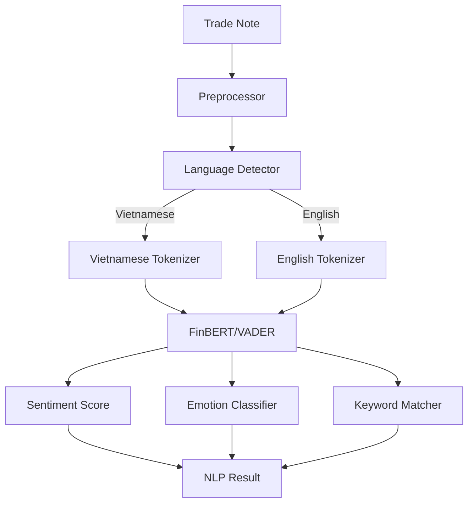

# 4. NLP Engine - Phân Tích Ngôn Ngữ Tự Nhiên

## 📋 Mô Tả Nghiệp Vụ

### Vấn đề cần giải quyết
Trader thường ghi chú khi giao dịch, những ghi chú này chứa thông tin quý giá về:
- **Tâm trạng** lúc vào lệnh (lo lắng, tự tin, sợ hãi)
- **Lý do** quyết định (tin tức, phân tích, cảm tính)
- **Kỳ vọng** (target, stop loss, thời gian hold)

NLP Engine sẽ **tự động phân tích** những ghi chú này để:
1. Xác định **sentiment** (tích cực/tiêu cực)
2. Phát hiện **emotional markers** (FOMO, Greed, Fear)
3. Đánh giá **quality of reasoning** (logic vs cảm tính)

### Ví dụ phân tích

| Ghi chú của Trader | Phân tích NLP |
|-------------------|---------------|
| "BTC breakout, phải vào ngay kẻo lỡ!" | 🔴 FOMO detected, Urgency: HIGH |
| "Đã phân tích kỹ, RR 1:3, chờ pullback" | 🟢 Rational, Confidence: MEDIUM |
| "Thua 3 lệnh rồi, lệnh này phải gỡ" | 🔴 REVENGE risk, Desperation: HIGH |
| "Theo trend lớn, size nhỏ test trước" | 🟢 Disciplined, Risk-aware: HIGH |

### Yêu cầu nghiệp vụ

| ID | Requirement | Mô tả |
|----|-------------|-------|
| NLP-01 | Bilingual | Hỗ trợ tiếng Việt và tiếng Anh |
| NLP-02 | Sentiment scoring | Score từ -1 (bearish) đến +1 (bullish) |
| NLP-03 | Emotion detection | Phát hiện Fear, Greed, FOMO, Anxiety |
| NLP-04 | Quality scoring | Đánh giá độ rational của reasoning |
| NLP-05 | Real-time | Phân tích trong <500ms |

---

## 🔧 Xử Lý Kỹ Thuật

### Kiến trúc NLP Pipeline



### Tech Stack

| Component | Technology |
|-----------|------------|
| Sentiment Analysis | FinBERT (ProsusAI/finbert) |
| Fallback Sentiment | VADER (1,600+ keywords) |
| Vietnamese NLP | PhoBERT hoặc Custom dictionary |
| Tokenization | underthesea (Vietnamese) |
| Inference | HuggingFace Transformers |

### Vietnamese Trading Keywords Dictionary

```python
VIETNAMESE_TRADING_KEYWORDS = {
    # FOMO indicators
    "fomo": {
        "keywords": [
            "sợ lỡ", "phải vào ngay", "mua gấp", "không kịp",
            "đang bay", "pump rồi", "fomo", "all in", "chốt liền",
            "bắt đáy", "đuổi giá", "lỡ tàu"
        ],
        "weight": -0.8,
        "emotion": "FOMO"
    },
    
    # Fear indicators
    "fear": {
        "keywords": [
            "sợ", "lo lắng", "hoang mang", "panic", "cắt lỗ ngay",
            "bán tháo", "dump", "sập", "crash", "liquidate"
        ],
        "weight": -0.6,
        "emotion": "FEAR"
    },
    
    # Greed indicators  
    "greed": {
        "keywords": [
            "x10", "x100", "moon", "rich", "giàu", "lời to",
            "all in", "leverage cao", "margin max", "full port"
        ],
        "weight": -0.5,
        "emotion": "GREED"
    },
    
    # Revenge indicators
    "revenge": {
        "keywords": [
            "gỡ gạc", "gỡ lại", "trả thù", "thua đủ rồi",
            "phải thắng", "không thể thua nữa", "lấy lại"
        ],
        "weight": -0.9,
        "emotion": "REVENGE"
    },
    
    # Rational indicators (positive)
    "rational": {
        "keywords": [
            "phân tích", "theo kế hoạch", "RR", "stop loss",
            "take profit", "quản lý vốn", "size nhỏ", "test",
            "chờ xác nhận", "pullback", "retest"
        ],
        "weight": 0.7,
        "emotion": "RATIONAL"
    },
    
    # Confidence indicators
    "confident": {
        "keywords": [
            "chắc chắn", "tin tưởng", "setup đẹp", "high probability",
            "theo trend", "xác nhận rồi"
        ],
        "weight": 0.5,
        "emotion": "CONFIDENT"
    }
}
```

### Implementation

#### Main NLP Engine
```python
class NLPEngine:
    def __init__(self):
        # Load FinBERT for financial sentiment
        self.finbert = pipeline(
            "sentiment-analysis",
            model="ProsusAI/finbert"
        )
        
        # VADER for backup/speed
        self.vader = SentimentIntensityAnalyzer()
        
        # Custom Vietnamese dictionary
        self.vn_keywords = VIETNAMESE_TRADING_KEYWORDS
    
    def analyze(self, text: str) -> NLPResult:
        # Detect language
        lang = self._detect_language(text)
        
        # Get sentiment score
        sentiment = self._get_sentiment(text, lang)
        
        # Detect emotions
        emotions = self._detect_emotions(text, lang)
        
        # Match behavioral keywords
        behavioral_flags = self._match_keywords(text)
        
        # Calculate quality score
        quality_score = self._assess_quality(text, emotions)
        
        return NLPResult(
            text=text,
            language=lang,
            sentiment_score=sentiment.score,
            sentiment_label=sentiment.label,
            emotions=emotions,
            behavioral_flags=behavioral_flags,
            quality_score=quality_score,
            warnings=self._generate_warnings(behavioral_flags)
        )
    
    def _detect_emotions(self, text: str, lang: str) -> List[Emotion]:
        emotions = []
        text_lower = text.lower()
        
        for category, data in self.vn_keywords.items():
            matched = [kw for kw in data["keywords"] if kw in text_lower]
            if matched:
                emotions.append(Emotion(
                    type=data["emotion"],
                    confidence=min(len(matched) * 0.2, 1.0),
                    matched_keywords=matched
                ))
        
        return emotions
    
    def _assess_quality(self, text: str, emotions: List[Emotion]) -> float:
        """
        Đánh giá chất lượng reasoning:
        - Có mention risk management? (+)
        - Có plan cụ thể? (+)
        - Có emotional markers? (-)
        """
        score = 0.5  # Baseline
        
        # Positive indicators
        if any(kw in text.lower() for kw in ["stop loss", "sl", "take profit", "tp"]):
            score += 0.15
        if any(kw in text.lower() for kw in ["rr", "risk reward", "quản lý vốn"]):
            score += 0.15
        if any(kw in text.lower() for kw in ["kế hoạch", "plan", "theo chiến lược"]):
            score += 0.1
        
        # Negative indicators
        for emotion in emotions:
            if emotion.type in ["FOMO", "REVENGE", "GREED"]:
                score -= 0.2 * emotion.confidence
            elif emotion.type == "FEAR":
                score -= 0.1 * emotion.confidence
        
        return max(0, min(1, score))
```

### Output Schema

```python
@dataclass
class NLPResult:
    text: str
    language: str  # "vi" or "en"
    
    # Sentiment
    sentiment_score: float  # -1 to 1
    sentiment_label: str    # "positive", "negative", "neutral"
    
    # Emotions detected
    emotions: List[Emotion]
    
    # Behavioral flags
    behavioral_flags: List[str]  # ["FOMO", "REVENGE", etc.]
    
    # Quality assessment
    quality_score: float  # 0 to 1
    
    # Generated warnings
    warnings: List[str]

@dataclass
class Emotion:
    type: str  # "FOMO", "FEAR", "GREED", "REVENGE", "RATIONAL", "CONFIDENT"
    confidence: float  # 0 to 1
    matched_keywords: List[str]
```

### Performance Optimization

```python
# Batch processing for historical analysis
async def analyze_batch(notes: List[str]) -> List[NLPResult]:
    # Use FinBERT batch inference
    sentiments = self.finbert(notes, batch_size=32)
    
    results = []
    for note, sentiment in zip(notes, sentiments):
        # Keyword matching is fast, run sequentially
        result = self._build_result(note, sentiment)
        results.append(result)
    
    return results

# Caching for repeated analysis
@lru_cache(maxsize=1000)
def analyze_cached(text_hash: str, text: str) -> NLPResult:
    return self.analyze(text)
```

### Implementation Files

| File | Chức năng |
|------|-----------|
| `nlp/nlp_engine.py` | Main NLP analysis engine |
| `nlp/vietnamese_keywords.py` | Vietnamese trading dictionary |
| `nlp/sentiment_analyzer.py` | FinBERT + VADER wrapper |
| `nlp/emotion_detector.py` | Emotion classification |
| `nlp/quality_scorer.py` | Reasoning quality assessment |

### API Endpoints

```python
POST /api/nlp/analyze           # Analyze single text
POST /api/nlp/analyze-batch     # Analyze multiple texts
GET  /api/nlp/keywords          # Get keyword dictionary
POST /api/nlp/feedback          # User feedback for improvement
```
