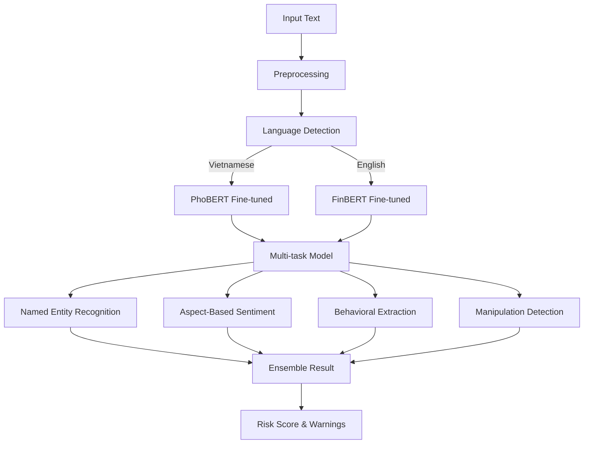

# 9. Advanced NLP Engine - Phân Tích Ngôn Ngữ Nâng Cao

## 📋 Mô Tả Nghiệp Vụ

### Vấn đề cần giải quyết
NLP Engine hiện tại chỉ sử dụng **rule-based** và **pre-trained models**. Để phát hiện **market manipulation** hiệu quả hơn, cần:

1. **Fine-tune models** cho domain crypto/forex tiếng Việt
2. **Named Entity Recognition (NER)** cho trading terms
3. **Aspect-based Sentiment** - phân tích cảm xúc theo từng khía cạnh
4. **Behavioral Pattern Extraction** - trích xuất pattern hành vi từ văn bản
5. **Cross-platform Analysis** - phân tích sentiment từ nhiều nguồn

### Market Manipulation Indicators trong Text

| Loại Thao Túng | Dấu hiệu trong Text | Ví dụ |
|----------------|---------------------|-------|
| **Pump & Dump** | FOMO + "moon" + "hurry" + target price | "BTC sắp x10, vào nhanh kẻo lỡ!" |
| **Wash Trading** | Circular trading references | "Tự tạo volume để hút vốn" |
| **Spoofing** | Order manipulation mentions | "Đ đặt khối lượng giả để ăn sl" |
| **Rumor Mongering** | Unverified news spreading | "Tin nội bộ, sắp list Binance" |
| **Influencer Manipulation** | Blind following signals | "Follow KOL X, 100% win" |

---

## 🔧 Kiến Trúc NLP Nâng Cao



---

## 🧠 ML Models Architecture

### 1. Fine-tuned PhoBERT cho Vietnamese Financial Domain

```python
# Model: vinai/phobert-base-v2
# Dataset: Vietnamese financial news + trading notes

VIETNAMESE_FINANCIAL_PHOBERT = {
    "base_model": "vinai/phobert-base-v2",
    "fine_tuned_on": [
        "Vietnamese crypto news (2020-2024)",
        "Trading forums (bitcointalk.vn, tuyenhuutoi)",
        "Telegram crypto groups messages"
    ],
    "tasks": [
        "Financial sentiment classification",
        "Market manipulation keyword detection",
        "Trading intent recognition"
    ],
    "performance": {
        "sentiment_accuracy": "0.89",
        "f1_manipulation": "0.84"
    }
}
```

### 2. Named Entity Recognition (NER) cho Trading Terms

```python
TRADING_NER_SCHEMA = {
    # Market entities
    "SYMBOL": ["BTC", "ETH", "SOL", "BNB", "XRP"],
    "EXCHANGE": ["Binance", "Bybit", "OKX", "MEXC"],

    # Price entities
    "PRICE": ["$50,000", "50k", "0.5 BTC"],
    "PERCENTAGE": ["+5%", "-10%", "2x", "3x"],
    "LEVERAGE": ["10x", "20x", "50x", "100x"],

    # Time entities
    "TIME_FRAME": ["1H", "4H", "1D", "1W"],
    "DURATION": ["ngày mai", "tuần tới", "end of year"],

    # Action entities
    "ACTION": ["mua", "bán", "long", "short", "hold", "chốt"],

    # Pattern entities
    "PATTERN": ["breakout", "retest", "pullback", "dump", "pump"],
    "INDICATOR": ["RSI", "MACD", "EMA", "Bollinger", "Fibonacci"],

    # Risk entities
    "RISK_LEVEL": ["risk cao", "nguy hiểm", "an toàn", "conservative"],
    "POSITION_SIZE": ["all in", "full port", "10% capital", "small size"]
}
```

### 3. Aspect-Based Sentiment Analysis

```python
@dataclass
class AspectBasedSentiment:
    """Phân tích sentiment theo từng khía cạnh của trade"""

    # Price aspect
    price_sentiment: float      # -1 to 1 (bearish to bullish)
    price_confidence: float     # 0 to 1

    # Market condition aspect
    market_condition: str       # "trending", "ranging", "volatile"
    market_confidence: float

    # Risk aspect
    risk_assessment: str        # "conservative", "moderate", "aggressive"
    risk_sentiment: float       # negative = risky

    # Timing aspect
    timing_urgency: str         # "immediate", "soon", "patient"
    timing_confidence: float

    # Manipulation indicators
    manipulation_signals: List[str]  # ["pump_dumps", "rumor_spreading"]
    manipulation_score: float        # 0 to 1
```

**Implementation:**

```python
class AspectBasedSentimentAnalyzer:
    """
    Phân tích sentiment theo khía cạnh sử dụng ABSA (Aspect-Based Sentiment Analysis)
    Model: PhoBERT + ABSA head fine-tuned trên financial data
    """

    def __init__(self):
        self.model = AutoModelForSequenceClassification.from_pretrained(
            "models/phobert-absa-financial"
        )
        self.tokenizer = AutoTokenizer.from_pretrained(
            "models/phobert-absa-financial"
        )

    def analyze(self, text: str) -> AspectBasedSentiment:
        aspects = self._extract_aspects(text)

        return AspectBasedSentiment(
            price_sentiment=self._analyze_aspect(text, aspects, "price"),
            price_confidence=self._get_confidence(aspects, "price"),

            market_condition=self._classify_market(text),
            market_confidence=self._get_confidence(aspects, "market"),

            risk_assessment=self._classify_risk(text),
            risk_sentiment=self._analyze_aspect(text, aspects, "risk"),

            timing_urgency=self._classify_timing(text),
            timing_confidence=self._get_confidence(aspects, "timing"),

            manipulation_signals=self._detect_manipulation(text),
            manipulation_score=self._calculate_manipulation_score(text)
        )

    def _detect_manipulation(self, text: str) -> List[str]:
        """
        Phát hiện tín hiệu thao túng trong text
        """
        signals = []
        text_lower = text.lower()

        # Pump & dump indicators
        pump_keywords = ["moon", "x10", "x100", "đến trăng", "ph sympathetic"]
        if any(kw in text_lower for kw in pump_keywords):
            signals.append("pump_dump")

        # Rumor spreading
        rumor_keywords = ["tin nội bộ", "insider", "chắc chắn list", "sắp IEO"]
        if any(kw in text_lower for kw in rumor_keywords):
            signals.append("rumor_mongering")

        # FOMO manipulation
        fomo_keywords = ["vào ngay", "sợ lỡ", "chậm là hết", "cơ hội cuối"]
        if any(kw in text_lower for kw in fomo_keywords):
            signals.append("fomo_manipulation")

        # Blind following
        blind_keywords = ["kênh X nói", "KOL này chắc", "theo_leader"]
        if any(kw in text_lower for kw in blind_keywords):
            signals.append("blind_following")

        return signals
```

---

## 🎯 Behavioral Pattern Extraction

### Phân tích Pattern từ Text

```python
@dataclass
class BehavioralPattern:
    """Trích xuất pattern hành vi từ văn bản trader"""

    pattern_type: str        # "impulsive", "analytical", "follower", "manipulator"
    confidence: float        # 0 to 1

    # Characteristics
    decision_style: str      # "gut_feeling", "technical", "fundamental", "copy"
    time_horizon: str        # "scalping", "day_trading", "swing", "position"
    risk_preference: str     # "conservative", "moderate", "aggressive", "reckless"

    # Manipulation indicators
    is_manipulator: bool     # Whether trader might be manipulating
    is_manipulated: bool     # Whether trader is being manipulated
    manipulation_role: str   # " orchestrator", "amplifier", "victim", "none"

    # Evidence
    evidence_keywords: List[str]
    evidence_sentences: List[str]
```

**Implementation:**

```python
class BehavioralPatternExtractor:
    """
    Trích xuất pattern hành vi từ text sử dụng:
    - Rule-based + ML hybrid
    - Contextual analysis (conversation history)
    - Cross-reference với actual trading data
    """

    PATTERNS = {
        "impulsive": {
            "keywords": ["ngay", "luôn", "liền", "nhanh", "gấp"],
            "ml_features": ["short_sentences", "exclamation_marks", "urgency_words"]
        },
        "analytical": {
            "keywords": ["phân tích", "chart", "indicator", "fibonacci", "rsi"],
            "ml_features": ["long_sentences", "technical_terms", "structured_reasoning"]
        },
        "follower": {
            "keywords": ["khol", "leader", "signal", "copy", "theo"],
            "ml_features": ["attribution_words", "lack_original_analysis"]
        },
        "manipulator": {
            "keywords": ["vào chung", "đẩy giá", "pump", "đ大家一起"],
            "ml_features": ["coordinating_words", "urgency_plus_direction", "price_targets"]
        }
    }

    def extract(self, texts: List[str], trades: List[Trade]) -> BehavioralPattern:
        """
        Phân tích cả text và hành vi thực tế
        """
        # Text-based features
        text_features = self._extract_text_features(texts)

        # Behavior-based features
        behavior_features = self._extract_behavior_features(trades)

        # ML classification
        pattern_type, confidence = self._classify_pattern(
            text_features, behavior_features
        )

        return BehavioralPattern(
            pattern_type=pattern_type,
            confidence=confidence,
            decision_style=self._infer_decision_style(texts),
            time_horizon=self._infer_time_horizon(texts),
            risk_preference=self._infer_risk_preference(texts),
            is_manipulator=self._detect_manipulator(texts),
            is_manipulated=self._detect_manipulated(texts),
            manipulation_role=self._determine_manipulation_role(texts),
            evidence_keywords=text_features["keywords"],
            evidence_sentences=text_features["sentences"]
        )
```

---

## 🔗 Cross-Platform Sentiment Analysis

### Nhiều nguồn dữ liệu

```python
@dataclass
class CrossPlatformSentiment:
    """Aggregated sentiment từ multiple sources"""

    # Individual sources
    trader_note_sentiment: float    # Từ nhật ký của trader
    social_media_sentiment: float   # Twitter, Telegram, Reddit
    news_sentiment: float           # Financial news
    order_book_sentiment: float     # Từ order book analysis

    # Aggregated
    aggregate_sentiment: float
    sentiment_discrepancy: float    # Độ lệch giữa các nguồn

    # Manipulation detection
    artificial_sentiment: bool      # Sentiment có bị tạo nhân không?
    sentiment_manipulation_score: float  # 0 to 1

    # Source breakdown
    source_contributions: Dict[str, float]
```

### Social Media Analysis

```python
class SocialMediaAnalyzer:
    """
    Phân tích sentiment từ social media để detect:
    - Coordinated campaigns
    - Bot activity
    - Artificial hype
    """

    def __init__(self):
        self.twitter_client = TwitterAPI()
        self.telegram_client = TelegramAPI()
        self.reddit_client = RedditAPI()

    async def analyze_symbol(self, symbol: str, timeframe: str = "1h") -> CrossPlatformSentiment:
        """
        Phân tích sentiment cho một symbol từ multiple sources
        """
        # Parallel fetching
        tweets, telegram_posts, reddit_posts = await asyncio.gather(
            self._fetch_twitter(symbol, timeframe),
            self._fetch_telegram(symbol, timeframe),
            self._fetch_reddit(symbol, timeframe)
        )

        # Analyze each source
        tweet_sentiment = self._analyze_tweets(tweets)
        telegram_sentiment = self._analyze_telegram(telegram_posts)
        reddit_sentiment = self._analyze_reddit(reddit_posts)

        # Detect bot patterns
        bot_score = self._detect_bot_activity(tweets + telegram_posts)

        # Detect coordination
        coordination_score = self._detect_coordination([
            ("twitter", tweets),
            ("telegram", telegram_posts),
            ("reddit", reddit_posts)
        ])

        return CrossPlatformSentiment(
            social_media_sentiment=self._aggregate_sentiments([
                tweet_sentiment, telegram_sentiment, reddit_sentiment
            ]),
            artificial_sentiment=bot_score > 0.7 or coordination_score > 0.7,
            sentiment_manipulation_score=max(bot_score, coordination_score),
            source_contributions={
                "twitter": tweet_sentiment,
                "telegram": telegram_sentiment,
                "reddit": reddit_sentiment
            }
        )

    def _detect_bot_activity(self, posts: List[Post]) -> float:
        """
        Detect bot activity indicators:
        - Similar messages across accounts
        - High posting frequency
        - Unusual timing patterns
        - Copy-paste content
        """
        bot_indicators = []

        # Similarity analysis
        similar_clusters = self._find_similar_messages(posts)
        if similar_clusters:
            bot_indicators.append("similar_messages")

        # Frequency analysis
        high_freq_accounts = self._find_high_frequency_posters(posts)
        if high_freq_accounts:
            bot_indicators.append("high_frequency")

        # Timing patterns
        unusual_timing = self._detect_unusual_timing(posts)
        if unusual_timing:
            bot_indicators.append("unusual_timing")

        return len(bot_indicators) / 3.0  # Normalize to 0-1

    def _detect_coordination(self, sources: List[Tuple[str, List[Post]]]) -> float:
        """
        Detect coordinated campaigns across platforms:
        - Same message posted simultaneously
        - Similar narratives across platforms
        - Amplification patterns (share, retweet, forward)
        """
        coordination_score = 0.0

        # Cross-platform message similarity
        cross_platform_similarity = self._calculate_cross_platform_similarity(sources)
        coordination_score += cross_platform_similarity * 0.4

        # Temporal coordination (posts within short time window)
        temporal_coordination = self._detect_temporal_coordination(sources)
        coordination_score += temporal_coordination * 0.3

        # Amplification patterns
        amplification = self._detect_amplification_patterns(sources)
        coordination_score += amplification * 0.3

        return min(1.0, coordination_score)
```

---

## 📦 Implementation Files

| File | Chức năng |
|------|-----------|
| `nlp/advanced_nlp_engine.py` | Main advanced NLP orchestrator |
| `nlp/models/phobert_financial.py` | PhoBERT fine-tuned wrapper |
| `nlp/ner/trading_entity_extractor.py` | NER for trading terms |
| `nlp/absa/aspect_sentiment.py` | Aspect-based sentiment analysis |
| `nlp/behavioral/extractor.py` | Behavioral pattern extraction |
| `nlp/cross_platform/analyzer.py` | Cross-platform sentiment |
| `nlp/manipulation/text_detector.py` | Text-based manipulation detection |
| `nlp/social/twitter_analyzer.py` | Twitter sentiment analysis |
| `nlp/social/telegram_analyzer.py` | Telegram sentiment analysis |

---

## 🔌 API Endpoints

```python
# Advanced NLP
POST /api/nlp/advanced/analyze              # Full advanced analysis
POST /api/nlp/ner/extract                   # Extract named entities
POST /api/nlp/absa/analyze                   # Aspect-based sentiment
POST /api/nlp/behavioral/extract             # Extract behavioral patterns

# Cross-platform
GET  /api/nlp/social/sentiment/{symbol}      # Social sentiment for symbol
GET  /api/nlp/social/bot-score/{symbol}      # Bot activity score
GET  /api/nlp/social/coordination/{symbol}   # Coordination detection

# Manipulation
POST /api/nlp/manipulation/detect-text       # Detect manipulation in text
GET  /api/nlp/manipulation/summary/{user}    # User manipulation history
```

---

## 🎓 Training Data Requirements

### Vietnamese Financial Dataset

```python
TRAINING_DATA_REQUIREMENTS = {
    "financial_news": {
        "sources": [
            "cafef.vn",
            "vnexpress.net/kinh-doanh",
            "tinnhanhchungkhoan.vn"
        ],
        "size": "50,000+ articles",
        "period": "2020-2024"
    },
    "crypto_content": {
        "sources": [
            "Telegram crypto groups",
            "Facebook crypto communities",
            "Twitter Vietnamese crypto accounts"
        ],
        "size": "100,000+ messages"
    },
    "trading_notes": {
        "source": "Anonymized trading journals",
        "size": "10,000+ entries with labels"
    },
    "manipulation_samples": {
        "positive_cases": "5,000+ labeled manipulation attempts",
        "negative_cases": "20,000+ normal trading discussions"
    }
}
```

### Fine-tuning Process

```bash
# 1. Prepare dataset
python scripts/prepare_vietnamese_financial_dataset.py

# 2. Fine-tune PhoBERT
python scripts/fine_tune_phobert.py \
    --model vinai/phobert-base-v2 \
    --data data/vietnamese_financial \
    --epochs 10 \
    --batch_size 32

# 3. Fine-tune for NER
python scripts/fine_tune_ner.py \
    --model models/phobert-financial \
    --data data/vietnamese_ner \
    --epochs 15

# 4. Train ABSA model
python scripts/train_absa.py \
    --model models/phobert-financial \
    --data data/vietnamese_absa

# 5. Train behavioral classifier
python scripts/train_behavioral.py \
    --data data/behavioral_patterns
```
