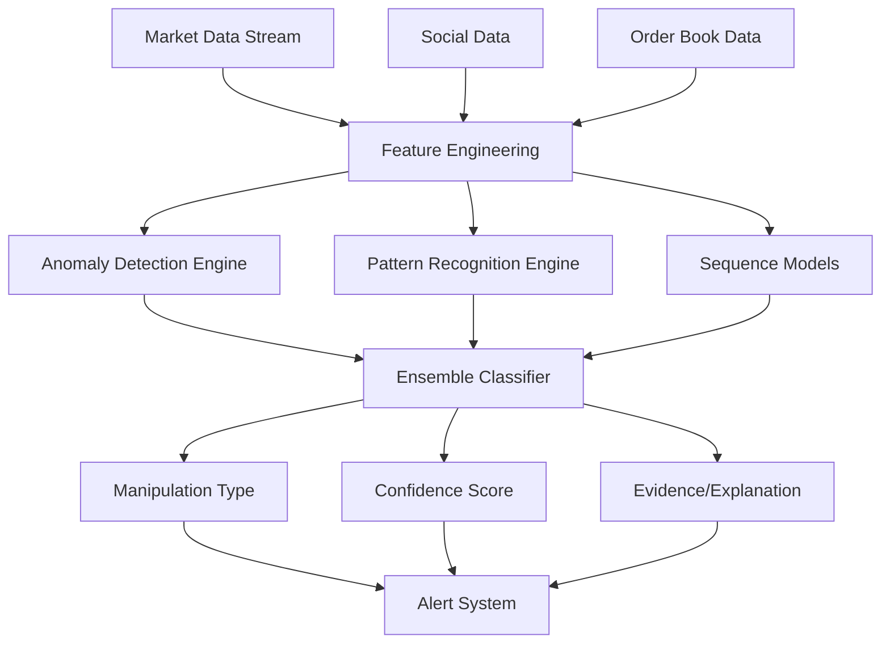

# 10. ML Manipulation Detection - Phát Hiện Thao Túng Bằng Machine Learning

## 📋 Mô Tả Nghiệp Vụ

### Vấn đề cần giải quyết
Market manipulation là vấn đề nghiêm trọng trong crypto/forex. Detection cần:

1. **Real-time detection** - Phát hiện trong khi đang xảy ra
2. **Multi-pattern detection** - Nhận diện nhiều loại manipulation
3. **Adaptive learning** - Học từ patterns mới
4. **Explainable AI** - Giải thích tại sao flag là manipulation

### Các loại Market Manipulation

| Loại | Mô tả | Dấu hiệu Technical | Dấu hiệu Social |
|------|-------|-------------------|-----------------|
| **Pump & Dump** | Đẩy giá rồi dump | Volume spike + price pump + sudden dump | Hype campaigns, "to the moon" |
| **Wash Trading** | Tự giao dịch với chính mình | Circular trading patterns | Unusual volume explanation |
| **Spoofing** | Đặt order giả để tạo liquidity | Large orders cancelled quickly | Discussions about "fake walls" |
| **Layering** | Multi-level fake orders | Multiple order levels + cancellations | |
| **Ramping** | Mua liên tục để đẩy giá | Sequential buying + price impact | |
| **Bear Raid** | Bán khống để đẩy giá xuống | Short selling + negative news timing | FUD campaigns |
| **Front-running** | Trade trước knowledge của large orders | Price movement before large trades | Insider discussions |
| **Quote Stuffing** | Spam orders để delay | Excessive order rate | |
| **Stop Hunting** | Đẩy giá đến stop loss clusters | Price testing key levels | |

---

## 🧠 ML Architecture



---

## 🎯 Model 1: Anomaly Detection

### Isolation Forest cho Price/Volume Anomalies

```python
from sklearn.ensemble import IsolationForest
from sklearn.preprocessing import StandardScaler
import numpy as np

class PriceVolumeAnomalyDetector:
    """
    Phát hiện bất thường trong price và volume patterns
    Sử dụng Isolation Forest - effective cho high-dimensional data
    """

    def __init__(self, contamination=0.1):
        self.scaler = StandardScaler()
        self.model = IsolationForest(
            contamination=contamination,
            random_state=42,
            n_estimators=100
        )

    def prepare_features(self, market_data: pd.DataFrame) -> np.ndarray:
        """
        Tính toán features cho anomaly detection
        """
        features = pd.DataFrame()

        # Price features
        features['price_change_1m'] = market_data['close'].pct_change(1)
        features['price_change_5m'] = market_data['close'].pct_change(5)
        features['price_change_15m'] = market_data['close'].pct_change(15)
        features['price_volatility_15m'] = market_data['close'].rolling(15).std()

        # Volume features
        features['volume_ratio'] = market_data['volume'] / market_data['volume'].rolling(50).mean()
        features['volume_change'] = market_data['volume'].pct_change(1)
        features['volume_volatility'] = market_data['volume'].rolling(15).std()

        # Price-volume relationship
        features['pv_correlation_5m'] = market_data['close'].rolling(5).corr(market_data['volume'])

        # Order book features (if available)
        if 'bid_volume' in market_data.columns:
            features['bid_ask_ratio'] = market_data['bid_volume'] / market_data['ask_volume']
            features['spread_pct'] = (market_data['ask'] - market_data['bid']) / market_data['close']

        # RSI indicators
        features['rsi_14'] = self._calculate_rsi(market_data['close'], 14)

        # Bollinger Band position
        bb_upper, bb_middle, bb_lower = self._calculate_bollinger(market_data['close'])
        features['bb_position'] = (market_data['close'] - bb_lower) / (bb_upper - bb_lower)

        return features.fillna(0).values

    def train(self, historical_data: pd.DataFrame):
        """
        Train model trên historical data (normal conditions)
        """
        features = self.prepare_features(historical_data)
        scaled_features = self.scaler.fit_transform(features)
        self.model.fit(scaled_features)

    def detect(self, current_data: pd.DataFrame) -> Dict:
        """
        Detect anomalies trong current data
        Returns: {
            'is_anomaly': bool,
            'anomaly_score': float (negative = more anomalous),
            'features_contributing': List[str]
        }
        """
        features = self.prepare_features(current_data)
        scaled_features = self.scaler.transform(features)

        prediction = self.model.predict(scaled_features)
        scores = self.model.score_samples(scaled_features)

        # Feature importance explanation
        feature_importance = self._explain_anomaly(scaled_features[0])

        return {
            'is_anomaly': prediction[0] == -1,
            'anomaly_score': float(scores[0]),
            'features_contributing': feature_importance
        }

    def _explain_anomaly(self, anomaly_sample: np.ndarray) -> List[str]:
        """
        Giải thích feature nào contribute nhiều nhất vào anomaly
        Sử dụng distance-based approach
        """
        feature_names = [
            'price_change_1m', 'price_change_5m', 'price_change_15m',
            'price_volatility_15m', 'volume_ratio', 'volume_change',
            'volume_volatility', 'pv_correlation_5m', 'bid_ask_ratio',
            'spread_pct', 'rsi_14', 'bb_position'
        ]

        # Calculate z-score for each feature
        z_scores = np.abs(anomaly_sample)

        # Get top contributing features
        top_indices = np.argsort(z_scores)[-3:][::-1]
        contributing = [feature_names[i] for i in top_indices]

        return contributing
```

### Local Outlier Factor (LOF) cho Order Book Patterns

```python
from sklearn.neighbors import LocalOutlierFactor

class OrderBookAnomalyDetector:
    """
    Phát hiện bất thường trong order book patterns
    Sử dụng LOF - good for detecting local anomalies in clusters
    """

    def __init__(self, n_neighbors=20, contamination=0.1):
        self.model = LocalOutlierFactor(
            n_neighbors=n_neighbors,
            contamination=contamination,
            novelty=True
        )

    def prepare_features(self, order_book: Dict) -> np.ndarray:
        """
        Trích xuất features từ order book snapshot
        """
        features = []

        # Bid-ask spread dynamics
        spread = order_book['ask'][0] - order_book['bid'][0]
        spread_pct = spread / order_book['ask'][0]
        features.append(spread_pct)

        # Order book imbalance
        bid_volume = sum([level['volume'] for level in order_book['bid'][:10]])
        ask_volume = sum([level['volume'] for level in order_book['ask'][:10]])
        imbalance = (bid_volume - ask_volume) / (bid_volume + ask_volume)
        features.append(imbalance)

        # Order book depth concentration
        bid_top3 = sum([level['volume'] for level in order_book['bid'][:3]])
        bid_total = sum([level['volume'] for level in order_book['bid'][:20]])
        depth_concentration = bid_top3 / bid_total if bid_total > 0 else 0
        features.append(depth_concentration)

        # Price levels with large orders
        large_orders = [level for level in order_book['bid'][:10]
                       if level['volume'] > bid_total * 0.2]
        features.append(len(large_orders))

        # Order cancellations (if time series data available)
        if 'cancellations' in order_book:
            cancellation_rate = order_book['cancellations'] / order_book['total_orders']
            features.append(cancellation_rate)

        return np.array(features).reshape(1, -1)

    def detect_spoofing(self, order_book_history: List[Dict]) -> Dict:
        """
        Detect spoofing patterns:
        - Large orders placed and cancelled quickly
        - Multiple levels with similar patterns
        """
        features_list = [self.prepare_features(ob) for ob in order_book_history]
        features_array = np.vstack(features_list)

        # Fit LOF
        self.model.fit(features_array)

        # Predict on recent data
        predictions = self.model.predict(features_array[-10:])
        scores = self.model.score_samples(features_array[-10:])

        # Spoofing indicators
        spoofing_indicators = []

        # High cancellation rate + large orders = potential spoofing
        if scores.min() < -1.5:
            spoofing_indicators.append("large_orders_cancelled")

        # Multiple levels with anomalies = layering
        anomaly_count = sum(1 for p in predictions if p == -1)
        if anomaly_count >= 3:
            spoofing_indicators.append("multi_level_layering")

        return {
            'is_spoofing': len(spoofing_indicators) > 0,
            'confidence': abs(scores.min()),
            'indicators': spoofing_indicators,
            'pattern': 'layering' if anomaly_count >= 3 else 'spoofing'
        }
```

---

## 🎯 Model 2: Pump & Dump Detection

### LSTM/GRU cho Sequence Pattern Detection

```python
import torch
import torch.nn as nn

class PumpDumpDetector(nn.Module):
    """
    Detect pump & dump patterns using sequence modeling
    Pattern: Rapid price increase + volume spike + sudden crash
    """

    def __init__(self, input_size=12, hidden_size=64, num_layers=2):
        super().__init__()
        self.hidden_size = hidden_size
        self.num_layers = num_layers

        # LSTM layer for sequence learning
        self.lstm = nn.LSTM(
            input_size=input_size,
            hidden_size=hidden_size,
            num_layers=num_layers,
            batch_first=True,
            dropout=0.2
        )

        # Attention mechanism
        self.attention = nn.MultiheadAttention(
            embed_dim=hidden_size,
            num_heads=4
        )

        # Classification layers
        self.fc1 = nn.Linear(hidden_size, 32)
        self.relu = nn.ReLU()
        self.dropout = nn.Dropout(0.3)
        self.fc2 = nn.Linear(32, 3)  # 3 classes: normal, pump, dump

    def forward(self, x):
        # x shape: (batch, seq_len, input_size)
        lstm_out, (h_n, c_n) = self.lstm(x)

        # Attention on sequence
        attn_out, attn_weights = self.attention(lstm_out, lstm_out, lstm_out)

        # Use last timestep
        last_out = attn_out[:, -1, :]

        # Classification
        out = self.fc1(last_out)
        out = self.relu(out)
        out = self.dropout(out)
        out = self.fc2(out)

        return out, attn_weights

class PumpDumpPipeline:
    """
    End-to-end pipeline for pump & dump detection
    """

    def __init__(self, model_path: str):
        self.model = PumpDumpDetector()
        self.model.load_state_dict(torch.load(model_path))
        self.model.eval()

        self.scaler = joblib.load('models/pump_dump_scaler.pkl')

    def prepare_sequence(self, market_data: pd.DataFrame, seq_len=50) -> torch.Tensor:
        """
        Chuẩn bị sequence data cho LSTM
        """
        features = pd.DataFrame()

        # Technical indicators
        features['returns'] = market_data['close'].pct_change()
        features['volume_change'] = market_data['volume'].pct_change()
        features['volume_ma_ratio'] = market_data['volume'] / market_data['volume'].rolling(20).mean()
        features['price_ma_ratio'] = market_data['close'] / market_data['close'].rolling(20).mean()

        # Momentum
        features['rsi'] = self._calculate_rsi(market_data['close'])
        features['momentum'] = market_data['close'] - market_data['close'].shift(4)

        # Volatility
        features['volatility'] = market_data['close'].rolling(10).std()

        # Price acceleration
        features['acceleration'] = features['returns'].diff()

        # Volume-price trend
        features['vpt'] = (features['returns'] * features['volume_change']).rolling(5).sum()

        # Drop NaN
        features = features.fillna(0)

        # Scale
        features_scaled = self.scaler.transform(features)

        # Create sequence
        if len(features_scaled) < seq_len:
            # Pad with zeros if not enough data
            pad_len = seq_len - len(features_scaled)
            features_scaled = np.vstack([
                np.zeros((pad_len, features_scaled.shape[1])),
                features_scaled
            ])

        return torch.FloatTensor(features_scaled[-seq_len:]).unsqueeze(0)

    def detect(self, market_data: pd.DataFrame) -> Dict:
        """
        Detect pump & dump in real-time
        """
        sequence = self.prepare_sequence(market_data)

        with torch.no_grad():
            output, attn_weights = self.model(sequence)

            # Get probabilities
            probs = torch.softmax(output, dim=1)
            pred_class = torch.argmax(probs, dim=1).item()
            confidence = probs[0][pred_class].item()

        # Analyze attention weights for explainability
        important_timesteps = self._analyze_attention(attn_weights)

        return {
            'prediction': ['normal', 'pump', 'dump'][pred_class],
            'confidence': confidence,
            'all_probabilities': {
                'normal': probs[0][0].item(),
                'pump': probs[0][1].item(),
                'dump': probs[0][2].item()
            },
            'important_timesteps': important_timesteps,
            'recommendation': self._get_recommendation(pred_class, confidence)
        }

    def _get_recommendation(self, pred_class: int, confidence: float) -> str:
        if pred_class == 1 and confidence > 0.7:  # Pump
            return "CẢNH BÁO: Pump detected! Tránh FOMO. Đợi pullback."
        elif pred_class == 2 and confidence > 0.7:  # Dump
            return "CẢNH BÁO: Dump detected! Cân nhắc exit nếu đang hold."
        else:
            return "Thị trường bình thường."
```

---

## 🎯 Model 3: Wash Trading Detection

### Graph-Based Detection

```python
import networkx as nx
from community import community_louvain

class WashTradingDetector:
    """
    Detect wash trading using graph analysis
    Pattern: Circular trading between related accounts
    """

    def __init__(self):
        self.graph = nx.DiGraph()
        self.account_clusters = {}

    def build_trading_graph(self, trades: List[Trade]) -> nx.DiGraph:
        """
        Xây dựng directed graph từ trading data:
        Nodes: Accounts, Addresses
        Edges: Transactions (weight = volume, frequency)
        """
        G = nx.DiGraph()

        for trade in trades:
            # Add nodes
            G.add_node(trade.buyer_account, type='account')
            G.add_node(trade.seller_account, type='account')

            # Add or update edge
            if G.has_edge(trade.seller_account, trade.buyer_account):
                G[trade.seller_account][trade.buyer_account]['volume'] += trade.volume
                G[trade.seller_account][trade.buyer_account]['count'] += 1
            else:
                G.add_edge(
                    trade.seller_account,
                    trade.buyer_account,
                    volume=trade.volume,
                    count=1,
                    timestamp=trade.timestamp
                )

        return G

    def detect_circular_trading(self, trades: List[Trade]) -> List[Dict]:
        """
        Detect circular trading patterns
        """
        G = self.build_trading_graph(trades)

        # Find all simple cycles up to length 6
        cycles = list(nx.simple_cycles(G))

        suspicious_cycles = []

        for cycle in cycles:
            if len(cycle) < 3 or len(cycle) > 6:
                continue

            # Analyze cycle
            cycle_volume = self._calculate_cycle_volume(G, cycle)
            cycle_frequency = self._calculate_cycle_frequency(G, cycle)
            timing_pattern = self._analyze_timing_pattern(G, cycle)

            # Suspicious indicators
            suspicion_score = 0
            reasons = []

            # High volume circular trading
            if cycle_volume > 1000000:  # Threshold
                suspicion_score += 30
                reasons.append(f"High volume cycle: ${cycle_volume:,.0f}")

            # Frequent circular trades
            if cycle_frequency > 10:  # More than 10 cycles
                suspicion_score += 30
                reasons.append(f"High frequency: {cycle_frequency} cycles")

            # Short time duration
            if timing_pattern['avg_duration_minutes'] < 5:
                suspicion_score += 20
                reasons.append("Rapid circular trading")

            # Same accounts repeatedly
            if timing_pattern['repeating_accounts'] == len(cycle):
                suspicion_score += 20
                reasons.append("Repeating accounts in cycle")

            if suspicion_score >= 50:
                suspicious_cycles.append({
                    'cycle': cycle,
                    'suspicion_score': suspicion_score,
                    'reasons': reasons,
                    'volume': cycle_volume,
                    'frequency': cycle_frequency
                })

        return sorted(suspicious_cycles, key=lambda x: x['suspicion_score'], reverse=True)

    def detect_related_accounts(self, trades: List[Trade]) -> Dict:
        """
        Detect accounts that might be controlled by same entity
        Using behavioral clustering
        """
        G = self.build_trading_graph(trades)

        # Community detection
        communities = community_louvain.best_partition(G.to_undirected())

        # Analyze each community
        suspicious_clusters = []

        for community_id in set(communities.values()):
            members = [node for node, comm in communities.items() if comm == community_id]

            if len(members) < 2:
                continue

            # Calculate cluster metrics
            cluster_metrics = self._analyze_cluster(G, members, trades)

            # Suspicious if:
            # - High internal trading volume
            # - Low external trading
            # - Similar trading patterns
            if cluster_metrics['internal_ratio'] > 0.8:
                suspicious_clusters.append({
                    'cluster_id': community_id,
                    'members': members,
                    'suspicion_score': cluster_metrics['internal_ratio'] * 100,
                    'reasons': cluster_metrics['reasons']
                })

        return suspicious_clusters

    def _analyze_cluster(self, G: nx.DiGraph, members: List[str], trades: List[Trade]) -> Dict:
        """
        Analyze a cluster of potentially related accounts
        """
        internal_edges = 0
        external_edges = 0
        internal_volume = 0
        external_volume = 0

        for u, v, data in G.edges(data=True):
            if u in members and v in members:
                internal_edges += data['count']
                internal_volume += data['volume']
            elif (u in members) != (v in members):  # XOR
                external_edges += data['count']
                external_volume += data['volume']

        total_volume = internal_volume + external_volume
        internal_ratio = internal_volume / total_volume if total_volume > 0 else 0

        reasons = []
        if internal_ratio > 0.8:
            reasons.append(f"{internal_ratio*100:.0f}% trading is internal")

        # Check timing patterns
        member_trades = [t for t in trades if t.buyer_account in members or t.seller_account in members]
        if self._has_similar_timing(member_trades):
            reasons.append("Accounts trade at similar times")

        return {
            'internal_ratio': internal_ratio,
            'internal_edges': internal_edges,
            'external_edges': external_edges,
            'reasons': reasons
        }
```

---

## 🎯 Model 4: Ensemble & Real-time Detection

### Multi-Model Ensemble

```python
class ManipulationDetectionEnsemble:
    """
    Combine multiple models for robust manipulation detection
    """

    def __init__(self):
        self.price_volume_detector = PriceVolumeAnomalyDetector()
        self.order_book_detector = OrderBookAnomalyDetector()
        self.pump_dump_detector = PumpDumpDetector('models/pump_dump.pt')
        self.wash_trading_detector = WashTradingDetector()

        # Weights for each model (learned from validation)
        self.weights = {
            'price_volume': 0.25,
            'order_book': 0.20,
            'pump_dump': 0.30,
            'wash_trading': 0.25
        }

    def detect(self, market_data: MarketSnapshot) -> ManipulationAlert:
        """
        Real-time detection using all models
        """
        results = {}

        # Price-volume anomalies
        results['price_volume'] = self.price_volume_detector.detect(market_data.ohlcv)

        # Order book spoofing
        if market_data.order_book:
            results['order_book'] = self.order_book_detector.detect_spoofing(
                market_data.order_book_history
            )

        # Pump & dump
        results['pump_dump'] = self.pump_dump_detector.detect(market_data.ohlcv)

        # Wash trading (batch, less frequent)
        if market_data.trades:
            results['wash_trading'] = self.wash_trading_detector.detect_circular_trading(
                market_data.trades[-100:]  # Last 100 trades
            )

        # Aggregate results
        alert = self._aggregate_results(results)

        return alert

    def _aggregate_results(self, results: Dict) -> ManipulationAlert:
        """
        Aggregate results from all models
        """
        manipulation_types = []
        total_score = 0
        total_weight = 0
        all_evidence = []

        for model_name, result in results.items():
            weight = self.weights.get(model_name, 0)
            if weight == 0:
                continue

            # Calculate score for this model
            if result.get('is_anomaly') or result.get('is_spoofing'):
                score = result.get('confidence', result.get('anomaly_score', 0.5))
                total_score += score * weight
                total_weight += weight

                # Extract manipulation type
                if model_name == 'pump_dump':
                    manipulation_types.append(result['prediction'])
                elif model_name == 'wash_trading':
                    manipulation_types.append('wash_trading')
                elif model_name == 'order_book':
                    manipulation_types.append(result.get('pattern', 'spoofing'))

                # Collect evidence
                all_evidence.extend(result.get('reasons', result.get('indicators', [])))

        final_score = total_score / total_weight if total_weight > 0 else 0

        return ManipulationAlert(
            manipulation_types=manipulation_types,
            severity=self._calculate_severity(final_score, manipulation_types),
            confidence=min(final_score, 1.0),
            evidence=all_evidence,
            timestamp=datetime.now()
        )

@dataclass
class ManipulationAlert:
    manipulation_types: List[str]  # ['pump', 'wash_trading', 'spoofing']
    severity: str                  # 'LOW', 'MEDIUM', 'HIGH', 'CRITICAL'
    confidence: float              # 0 to 1
    evidence: List[str]            # Explanation
    timestamp: datetime

    def to_dict(self) -> Dict:
        return {
            'types': self.manipulation_types,
            'severity': self.severity,
            'confidence': self.confidence,
            'evidence': self.evidence,
            'timestamp': self.timestamp.isoformat()
        }
```

---

## 📊 Training & Evaluation

### Dataset Requirements

```python
MANIPULATION_DATASET = {
    "price_volume": {
        "normal_samples": 100000,
        "pump_samples": 5000,
        "dump_samples": 5000,
        "features": ["ohlcv", "volume", "spread"]
    },
    "order_book": {
        "normal_samples": 50000,
        "spoofing_samples": 2000,
        "layering_samples": 2000
    },
    "wash_trading": {
        "labeled_cases": 1000,
        "features": ["account_graph", "timing", "volume_patterns"]
    }
}
```

### Evaluation Metrics

```python
METRICS = {
    "precision": "True positives / (True positives + False positives)",
    "recall": "True positives / (True positives + False negatives)",
    "f1": "2 * (precision * recall) / (precision + recall)",
    "auc_roc": "Area under ROC curve",
    "false_positive_rate": "Critical for real-time alerts",
    "detection_time": "Must be < 100ms for real-time"
}
```

---

## 📦 Implementation Files

| File | Chức năng |
|------|-----------|
| `ml/anomaly/price_volume_detector.py` | Isolation Forest detector |
| `ml/anomaly/order_book_detector.py` | LOF for order book |
| `ml/pump_dump/lstm_detector.py` | LSTM/GRU model |
| `ml/pump_dump/trainer.py` | Training pipeline |
| `ml/wash_trading/graph_detector.py` | Graph-based detection |
| `ml/ensemble/detector.py` | Multi-model ensemble |
| `ml/evaluation/metrics.py` | Evaluation metrics |

---

## 🔌 API Endpoints

```python
# Real-time detection
POST /api/ml/detect                          # Full detection
GET  /api/ml/status/{symbol}                 # Current manipulation status
WS   /ws/ml/alerts/{symbol}                  # Real-time alerts

# Historical analysis
GET  /api/ml/history/{symbol}                # Historical detections
GET  /api/ml/statistics                      # Detection statistics

# Model management
POST /api/ml/models/retrain                  # Retrain models
GET  /api/ml/metrics                         # Model performance
```
